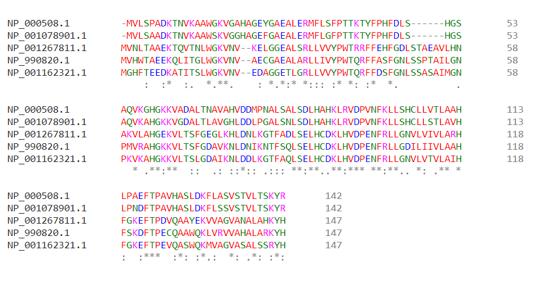

Examples
========

Example Group 1
---------------
In order to prove that the program works correctly, we have aligned a fasta and calculated all the scores.

The file consists of 5 protein sequences from 5 different organisms: Homo sapiens, Gallus gallus (rooster), Equus caballus (horse),Papio anubis (primate) and Loxodonta africana (elephant). Those sequences, express a hemoglobin subunit, which can be alpha,beta, gamma or delta.

Hemoglobin is a protein present in the red blood cells that carries oxygen from the lungs to the organs and tissues of the body. In addition, it transports carbon dioxide and hydrogen ions back to the lungs.
This protein is has four different subunits, where each of them is a globular protein with an heme group.
All of them have the same function, they bind one oxygen molecule thanks to ion-induced dipole force.

We have took this protein as an example, for the main reason that it is such an important protein that takes an essential function in the organisms.

The example already aligned with 'ClustalW' is the following:

If we compute the scores, we obtain this result:

.. figure:: resources/images/resulthemoglobinExample.PNG

Example Group 2
---------------

To carry out this example, we have chosen the protein Aurora kinase B. It is a protein whose main molecular function is related to cellular mitosis and meiosis. To perform the alignment we have taken the sequence of the organisms Homo sapiens (Human), Mus musculus (Mouse), Rattus norvegicus (Rat), Sus scrofa (Pig), Bos taurus (Bovine) and Xenopus laevis (African clawed frog).

In all of them the Aurora Kinase B protein is involved in the cell division process, specifically in the action carried out by the microtubules. These are in charge of aligning the chromosomes in the center of the dividing cell, so that after a depolarization the separation of the two chromatids on each chromosome is achieved. What is considered one of the fundamental steps during cell division.

Our protein aurora kinase B is found in microtubules close to kinetochores, specifically in those specialized called K fibers.

Its importance of study resides in the fact that the overexpression of this protein causes an uneven distribution of the genetic content, generating aneuploid cells, a distinctive mark of cancer.

On the other hand, another of its molecular functionalities is the union of metal ions, which is also worth mentioning because a failure in the proteins that have this molecular function can trigger the accumulation of metals at harmful levels in the organism.

Finally, it was also studied that the axotomy of some cultured neurons showed a clear positive regulation in the expression of the gene of our protein, coinciding with an axonal regenerative outbreak. Furthermore, overexpression of Aurora B kinase has been shown to produce accelerated axonal growth in spinal motor neurons during zebrafish growth.

For all these curiosities and the number of organisms that contain it, we have decided to take this protein as an example.

 .. figure:: resources/images/AlineamientoGrupo2.jpeg

The alignment shown has been done with 'Clustalw', a tool for biological sequence alignments. Finally, let's pass this alignment to the 'Examples2' class and run it.We get the following information:

 .. figure:: resources/images/ResultadosExample2.png

We can observe that the entropy is 2.07. Regarding the percentage of non-gaps and the percentage of conserved columns, they are 96.07% and 60.38%, respectively. The score obtained applying the star method in the PAM250 substitution matrix is 9303, while applied to Blosum62 it is 9512. Finally, we see that the sum of pairs of PAM250 is 21319 and of Blosum62 is 21618.

Example Group 3
---------------

To see how the program works, let's make an example. We have selected 4 sequences of insulin, a hormone produced by the pancreas that is in charge of regulating the amount of glucose in the blood. The 4 sequences come from 4 different mammalian organisms.

We have introduced the sequences in an option offered by the NCBI, which allows to align a series of sequences.

We have downloaded the alignment in FASTA format and then used that file to make the example.

The result obtained with this example is:

 .. figure:: resources/images/ResultadosExample3.jpeg

The alignment of the sequences shown below has been obtained using Clustal Omega, a new MSA tool that uses seeded guide trees and HMM profile-profile techniques to generate alignments:

 .. figure:: resources/images/AlineamientoExample3.jpeg

Example Group 5
---------------

For this example we chose 3 sequences for diferent subtypes of VIH envelope protein p160. The study of
this protein is interesting because to this day only inactivated whole virus vaccines had been shown
to protect macaques from SIV(The simian equivalen of VIH), but recent studies have shown that antibodies
against this protein is enough to develop an inmunization. So, in order to produce a vaccines, it would
be interesting to determinate the conserved regions of multiples subtypes of this protein.
In this case, we used virus type 1 group M subtype F1,  group M subtype A and group M subtype G sequences
from uniprot.
To perform the MSA we used CLUSTAL O(1.2.4) multiple sequence alignment and the results were the following.

    .. figure:: resources/imagesG5/G5ColorizedMSA1.jpeg
    .. figure:: resources/imagesG5/G5ColorizedMSA2.jpeg

Highligting the conserved regions:

    .. figure:: resources/imagesG5/jMSAColorized.jpeg

After passing the MSA to our program we obtained the following scores:

    .. figure:: resources/imagesG5/jMSAEjemplo.jpeg

Given this results, we can say that CLUSTAL is very similar to what we call high quality sequence alignments.

