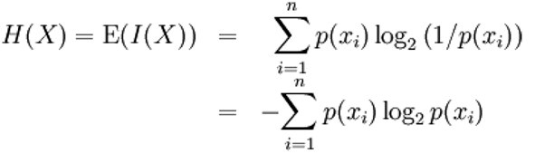

Scores
======

Explanation of the scores here ...

Star
----

The Star method is one of the algorithms used to score multi-sequence alignment.
It was proposed by Gusfield in 1997 and consists of finding the best aligned sequence
with the others (center) by scoring in pairs. This method makes use of a substitution matrix.

The following process is carried out:

- Search for the most recurring symbol (nucleotide or aminoacid) in each column of the sequence set.

- Calculate the distances from the remaining symbols to the most repeated from a substitution matrix.

.. figure:: /resources/image/Captura2.PNG

That way, the form of a Star emerges:

.. figure:: /resources/image/Captura4.PNG

IMPLEMENTATION

We have created a function called `aaMoreRepeated`, in which we select the most repeated symbol
of all the sequences in each column, so we're going build a map in which we will store the symbol
along with its frequency of occurrence.

For every character in the column we're working with, we check if it's
included on the map. If it is not, we include it as a key and put its value to 1.
If it is included, we add one to the frequency, delete the previous relationship
and introduce the amino acid with its new frequency.

.. code-block:: java

    public Character aaMoreRepeated(char[][] parameterSequence, int parameterPosAAinSequence){

        HashMap<Character, Integer> charFreq = new HashMap<Character, Integer>();

        for (int numberOfSequence = 0; numberOfSequence < parameterSequence.length; numberOfSequence++) {
          Character aa = parameterSequence[numberOfSequence][parameterPosAAinSequence];
          if (charFreq.containsKey(parameterSequence[numberOfSequence][parameterPosAAinSequence])) {
            Integer newFreq = (Integer) charFreq.get(aa) + 1;
            charFreq.remove(aa);
            charFreq.put(aa, newFreq);
          } else {
            charFreq.put(aa, 1);
          }
        }

Once all the frequencies have been calculated, we must select the highest one.
We use a for loop in which we compare the frequency saved for each character
with a counter that we've initialized to 0. Every time the frequency is higher
than the one stored in the counter, we update the counter with that new frequency
and we store the amino acid that has that frequency.

.. code-block:: java

        int moreRepeatedFreq = 0;
        Character moreRepeatedAA = parameterSequence[0][parameterPosAAinSequence];

        for (Map.Entry<Character, Integer> entry : charFreq.entrySet()) {
          if (entry.getValue() > moreRepeatedFreq) {
            moreRepeatedAA = entry.getKey();
            moreRepeatedFreq = entry.getValue();
          }
        }
        return moreRepeatedAA;

Finally, we calculate the distances of each symbol in the column from the
symbol with the highest value in that column. We do this within the function
called `compute`. This function is introduced by the set of sequences.
We go through each of the columns, and for each one we call the function 'moreRepeatedAA',
which will give us the most repeated character.

Once we have it, we calculate the distance of that symbol with the rest
of the symbols of the column.

.. code-block:: java

    public double compute(char[][] sequence) {
        double result = 0;

        for (int posAAinSequence = 0; posAAinSequence < sequence[0].length; posAAinSequence++) {

          Character moreRepeatedAA = aaMoreRepeated(sequence, posAAinSequence);

          // 2. We compute the punctuation for this column
          for (char[] chars : sequence) {
            double distance = scoreMatrix.getDistance(moreRepeatedAA, chars[posAAinSequence]);

            // 3. We add the distance to the total result we have to return
            result = result + distance;
          }
        }
        return (result);
      }

Sum of pairs
------------
Sum of pairs is a method of evaluating the quality of multiple sequence alignment.
This method assigns a specific score to the set of possible pair combinations using a substitution matrix. Its operation consists of, given a sequence alignment, selecting by column the possible pair combinations and identifying the sum of the values provided by the substitution matrix, which gives us a final sum made up of the sums of each column.

That is: given an alignment A composed of 4 sequences such that:

S1: ATGCTA

S2: CT-CAA

S3: AT-CTA

S4: -TGATA

Our method sequentially selects each column and for each column it will select all possible nucleotide pair combinations for that column. Each possible pair will be translated into a numerical value given by the substitution matrix, these values will be added together to finally obtain a final value.
The higher the final value, the better the alignment.

Percentage of non-gaps
----------------------
Visual depictions of the alignment illustrate mutation events such as point mutations (single amino acid or nucleotide changes) that appear as differing characters in a single alignment column, and insertion or deletion mutations (indels or gaps) that appear as hyphens.
 
This part of the programme is going to calculate the number of non-gaps in an alignment sequence. This is super important since the objective of the MSA, among others,  is to optimize to the maximum the value of the non-gaps-percentage.
 
That is the reason why we are going to create the class *PercentageOfNonGaps*
 
This class implements Score class. It has a method called *compute()* which we pass a matrix as a parameter. A counter for non-gaps is initialized to zero This method has nested loop to loop through it.  If the element we read is different from a hyphens, we increase the counter.
Finally we divide this counter between the total length of the sequence. To obtain a percentage over 100, we multiply the result by 100. 
 

Percentage of totally conserved columns
---------------------------------------

The percentage of conserved columns is very important because it has many aplications in studies of phylogenetics and taxonomy, in medical researches and in functional annotation.
  - Phylogenetics and taxonomy: the sets of conserved columns can be used to create an evolution tree to study the species and their ancestors.
  - In medical researches the applications of the MSA and specifically the amount of conserved columns it's used to identifi genetics diseases, in the compatibility between species so we can study the pathology on lab organisms instead of humans...
  - Identifying the conserved columns can be very helpful to predict functional sequences such as genes, besides, if the secuences have a known function, they can also be used to predict the function of those proteins; in order to create databases.
 
 Our class measures the amount of conserved columns by implementing the class score, and finding the sequences who are conserved and then returning the percentege ot total conserved columns of the array.

Entropy
-------

- Definition:

Entropy of Shanon can be defined as grade of disorder that a random variable can generate. It is related to the uncertainty that exists in
an experiment, as the amount of "noise" that contains the system.

However, it is also related to  the physics' magnitude that allows us to measure the non-usable part of the energy
contained in a system of particles or data. That means that that part of the total can not be used to produce
physical work.

In our case, it is useful in order to measure how diverse are the residues in a column. This is vey important when scoring MSA because it
represents how much distance exist between the sequences. Entropy is important because it tells us that systems can't go back in their processes and how is the energy wasted in a closed environment.
Mathematically it's represented by the summation of residue's frequency times the logarithm of different residue's number, as it can be observed in
the following picture:

- Implementation:

We have created a function called compute, which receives a sequence and creates a HashMap <String, Integer>
with the number of times a nucleotide appears. We have supposed that the sequence doesn't contains incorrect characters.
Once we have the frequencies of nucleotide, we can apply the formula of Shanon Entropy.
In addition, we have implemented a range of JUnit Tests in order to be secure that the code works correctly.

