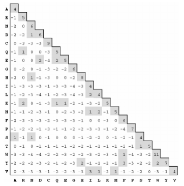

Subtitution Matrix
==================

Theoric base.
-------------

Substitution matrices show the probability of an amino accid mutating or being substituted by 
another one. The simplest matrix  would be the 'match/mismatch' one, which asigns a positive value
to the positions where both sequences concur adn a negative value when they don't.

.. note::
    Substitution matrices are used to score alignements between sequences, i. e., to see the similarity
    degree between them. The higher the score, the better, and the alignment with the highest score
    between all possible alignements is called "optimun alignment".

PAM
^^^

The PAM matrix (Point accepted mutation) represents the substitution, on average, of 1% of amino acids
of another.

PAM250, the one we're using, is optimized for alignments with approxi-mately 20% identical residues.

Blossum
^^^^^^^

The Blossum matrix (Block-sum) uses a more direct approach when estimating target frequencies 
Said ‘blocks’ consist of aligned protein segments that are relatively well-conserved across whole 
protein families.

.. image:: resources/images/Blossum62.PNG

The BLOSUM-62 matrix (which corresponds roughly toPAM-180 and is the one whe will be using) is derived
by first clustering all segments that are more than 62% identical.

Class structure.
----------------

Blossum62 and PAM250 classes implement the SubstitutionMatix interface.

These classes have two constructors , one without parameters and other with the desired gap score as 
parameter. We also have a matrixReader method, which reads the matrix from a file, a method called 
getDistance, which, given to characters, returns the distance in the matrix between them, and the 
methods getGapCharacter and getGapPenalty.

The matrixReader method relies on the class SubstitutionMatrixReader:

.. code-block:: java

    public HashMap<List<Character>, Integer> readMatrixFromFile(String file, SubstitutionMatrix substitutionMatrix) {
        HashMap<List<Character>, Integer> NewSubstitutionMatrix = new HashMap<>();
        String line;
        List<String> guide = null;
        List<Character> key1;
        List<Character> key2;
        int value;

        try (BufferedReader fileReader = new BufferedReader(new FileReader(String.valueOf(Paths.get(file))))) {
            while ((line = fileReader.readLine()) != null) {
                //The first nine lines start by # -> they don't contain substitutionMatrix distances
                if (!line.startsWith("#")) {
                    List<String> lineMatrix = Arrays.asList(line.trim().split("\\s+"));
                    if (line.startsWith(" ")) {
                        //The first line, with amino acids values -> this is the guide to compare with aas in rest of lines
                        guide = lineMatrix;
                    } else for (int i = 0; i < Objects.requireNonNull(guide).size(); i++) {
                        //Two keys to get the aas in both ways
                        key1 = new ArrayList<>();
                        key2 = new ArrayList<>();

                        key1.add(lineMatrix.get(0).charAt(0));
                        key1.add(guide.get(i).charAt(0));

                        key2.add(guide.get(i).charAt(0));
                        key2.add(lineMatrix.get(0).charAt(0));

                        if (!NewSubstitutionMatrix.containsKey(key1) && !NewSubstitutionMatrix.containsKey(key2)) {
                            //For determinate gapPenalty -> we check if gapPenalty value has been initialized
                            if ((key1.get(0).equals(substitutionMatrix.getGapCharacter()) ^ key1.get(1).equals(substitutionMatrix.getGapCharacter())) &&
                                    (substitutionMatrix.getInitialGapPenalty() != null)) {
                                //It changes gapPenalty value in matrix
                                value = substitutionMatrix.getInitialGapPenalty().intValue();
                            } else {
                                //It takes gapPenalty value from substitutionMatrix file (default gapPenalty)
                                value = Integer.parseInt(lineMatrix.get(i + 1));
                                if ((key1.get(0).equals(substitutionMatrix.getGapCharacter()) ^ key1.get(1).equals(substitutionMatrix.getGapCharacter()))){
                                    substitutionMatrix.setGapPenalty(Double.valueOf(value));
                                }
                            }

                            NewSubstitutionMatrix.put(key1, value);
                        }
                    }
                }
            }
            //Exception control
        } catch (FileNotFoundException e) {
            System.out.println("File not found");
            System.exit(1);
        } catch (IOException e) {
            System.out.println("An IO error has occured: " + e.getMessage());
            System.exit(1);
        }

        return NewSubstitutionMatrix;
    }

The getDistance method.

.. code-block:: java

    public double getDistance(char char1, char char2) {
        List<Character> pair = new ArrayList<>();
        pair.add(char1);
        pair.add(char2);
        double distance;

        if (!subsMatrix.containsKey(pair)) {
            Collections.reverse(pair);
        }
        distance = Double.valueOf(subsMatrix.get(pair));
        return distance;
    }

